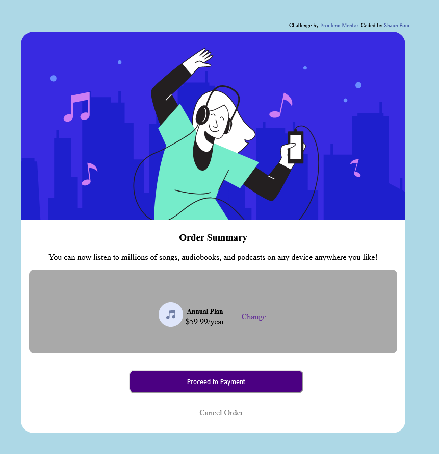

# Frontend Mentor - Order summary card solution

This is a solution to the [Order summary card challenge on Frontend Mentor](https://www.frontendmentor.io/challenges/order-summary-component-QlPmajDUj). Frontend Mentor challenges help you improve your coding skills by building realistic projects. 

## Table of contents

- [Overview](#overview)
  - [The challenge](#the-challenge)
  - [Screenshot](#screenshot)
  - [Links](#links)
- [My process](#my-process)
  - [Built with](#built-with)
  - [What I learned](#what-i-learned)
  - [Continued development](#continued-development)
  - [Useful resources](#useful-resources)
- [Author](#author)
- [Acknowledgments](#acknowledgments)

**Note: Delete this note and update the table of contents based on what sections you keep.**

## Overview

### The challenge

Users should be able to:

- See hover states for interactive elements

### Screenshot

### Links

- Solution URL: [https://github.com/DarkPhoenixNinja92/Order-Summary-Component](https://github.com)
- Live Site URL: [https://darkphoenixninja92.github.io/Order-Summary-Component/](https://darkphoenixninja92.github.io.com)

## My process

### Built with

- Semantic HTML5 markup
- SCSS custom properties
- Mobile-first workflow

### What I learned

One thing I learned doing this project was 

### Continued development

I want to focus on flexbox and css grid in the future as these are elements of css I rarely use and thus am the least comfortable with using.

### Useful resources

- [W3Schools - rounded borders](https://www.w3schools.com/css/css3_borders.asp) - This helped me because I forgot how to round element corners as I almost never do this.
- [Developer Mozilla - Using Media Queries](https://developer.mozilla.org/en-US/docs/Web/CSS/Media_Queries/Using_media_queries) - I used this to look up how to structure a media query. While I use these in nearly every project, I rarely remember exactly how one is supposed to be set up and so frequently must look it up.

**Note: Delete this note and replace the list above with resources that helped you during the challenge. These could come in handy for anyone viewing your solution or for yourself when you look back on this project in the future.**

## Author

- Website - [Shaun Pour](https://www.shaunpourdev.com)
- Frontend Mentor - [@darkphoenixninja92](https://www.frontendmentor.io/profile/DarkPhoenixNinja92)